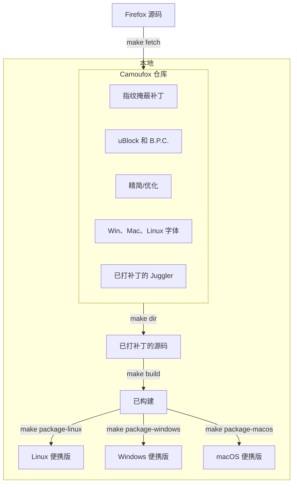

以下是构建系统及其关联的 make 命令图表：

```mermaid
graph TD
    FFSRC[Firefox 源码] -->|make fetch| REPO

    subgraph REPO[Camoufox 仓库]
        PATCHES[指纹掩蔽补丁]
        ADDONS[uBlock 和 B.P.C.]
        DEBLOAT[精简/优化]
        SYSTEM_FONTS[Win、Mac、Linux 字体]
        JUGGLER[已打补丁的 Juggler]
    end

    subgraph Local[本地]
    REPO -->|make dir| PATCH[已打补丁的源码]
    PATCH -->|make build| BUILD[已构建]
    BUILD -->|make package-linux| LINUX[Linux 便携版]
    BUILD -->|make package-windows| WIN[Windows 便携版]
    BUILD -->|make package-macos| MAC[macOS 便携版]
    end

```

这最初是基于 LibreWolf 的构建系统。
