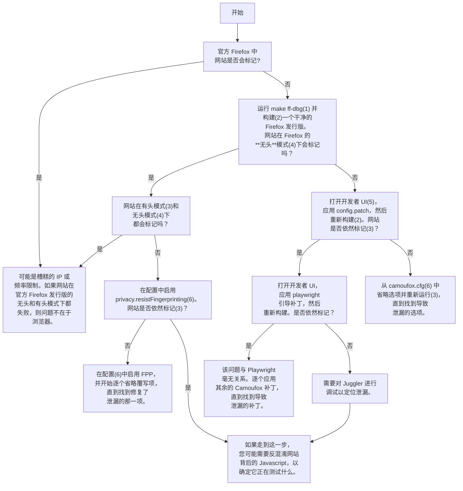

这是一个流程图，展示了我在不反混淆 WAF JavaScript 的情况下确定泄漏的过程。该方法将 Camoufox 的功能逐步重新引入到 Firefox 的源码中，直到测试网站将其标记（flag）为止。

此过程需要 Linux 系统，并假设您已安装 Firefox 构建工具（参见 [此处](https://github.com/daijro/camoufox?tab=readme-ov-file#build-cli)）。

## 流程图 (Flowchart)

## 引用的命令 (Cited Commands)

| # | 命令 (Command) | 说明 (Description) |
| --- | --- | --- |
| (1) | `make ff-dbg` | 设置带有极简补丁的原生 Firefox。 |
| (2) | `make build` | 构建源代码。 |
| (3) | `make run` | 运行构建好的浏览器。 |
| (4) | `make run args="--headless https://test.com"` | 在无头（headless）模式下运行某个 URL。所有的重定向信息都将打印到控制台，以判断测试是否通过。 |
| (5) | `make edits` | 打开开发者 UI。允许用户应用/撤销补丁，并查看当前已应用了哪些补丁。 |
| (6) | `make edit-cfg` | 在系统默认编辑器中编辑 camoufox.cfg。 |

